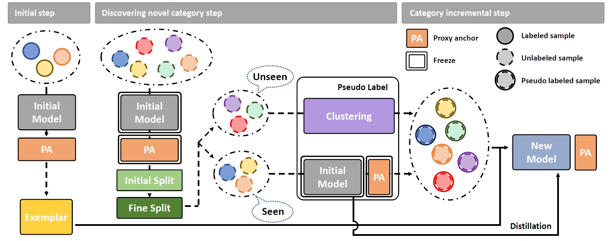

# Proxy Anchor-based Unsupervised Learning for Continuous Generalized Category Discovery

Official PyTorch implementation of ICCV 2023 paper

[**Proxy Anchor-based Unsupervised Learning for Continuous Generalized Category Discovery**](https://arxiv.org/abs/2307.10943).

Code will be available soon.

## Requirements
- Python3
- PyTorch (> 1.0)
- NumPy
- tqdm

## Datasets
1. Download four public benchmarks for fine-grained dataset
   - [CUB-200-2011](http://www.vision.caltech.edu/visipedia-data/CUB-200-2011/CUB_200_2011.tgz)
   - [MIT-67: Indoor Scene Recognition](http://groups.csail.mit.edu/vision/LabelMe/NewImages/indoorCVPR_09.tar)
   - [Stanford Dogs Dataset](http://vision.stanford.edu/aditya86/ImageNetDogs/images.tar)
   - [FGVC-Aircraft Benchmark](https://www.robots.ox.ac.uk/~vgg/data/fgvc-aircraft/archives/fgvc-aircraft-2013b.tar.gz)

2. Extract the tgz or zip file into `./data/` (Exceptionally, for CUB-200-2011, put the files in a `./data/CUB200`)

## Acknowledgements
Our code is modified and adapted on these great repositories:

- [Proxy Anchor Loss for Deep Metric Learning](https://github.com/tjddus9597/Proxy-Anchor-CVPR2020)

## New Method for Further Improvement
.

## Citation
If you use this method or this code in your research, please cite as:

## License
This project is licensed under the MIT License - see the [LICENSE](LICENSE) file for details.
